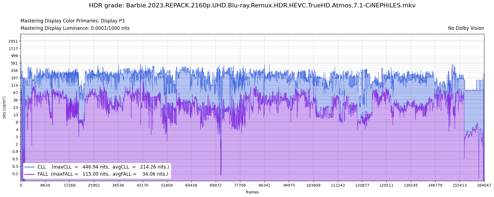
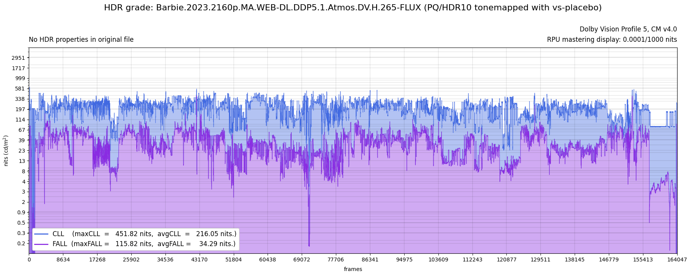

# HDRplot

## Description

There are at least two good reasons to measure the HDR grade of a hevc/mkv video file.
1. Some remuxes miss the HDR metadata maxCLL/maxFALL. As you are supposed to provide this metadata when encoding, 
you sometimes need to measure them. The function `measure_hdr10_content_light_level` in [awsmfunc](https://github.com/OpusGang/awsmfunc) does that. `HDRplot` also provides the functionality and will yield identical results to those of `measure_hdr10_content_light_level` with default parameters.
2. When you want to inject the DoVi/HDR10+ metadata of a web-dl into a HDR remux, you have to check previously that the HDR grades match. One way to do that is to check that the brightness match on screenshots taken from both sources. The other way is to plot the HDR grades of the 2 sources. This is what HDRplot does. For this functionality, an essential feature is to tonemap a DoVi P5 video file to HDR before drawing the plot. Such a functionality is already implemented in [DoVi_Scripts](https://github.com/R3S3t9999/DoVi_Scripts). But tonemapping in `DoVi_Scripts` relies on `madVR` which is not available for Linux/macOS. `HDRplot` aims at providing a cross-platform alternative within `VapourSynth`.

## Requirements

This script needs a working installation of `VapourSynth` with the `ffms2` indexer. It also require to have compiled the `vs-placebo` plugin with option `dovi`. Finally, `ffmpeg`, `dovi_tool` and `mediainfo` must be on path.

## Screenshots

## Features

* Can measure the HDR grades of any HDR10/HDR10+/DoVi hevc/mkv video file.
* In case of a DoVi P5 file, a preliminary tonamap to PQ/HDR10 will be performed.
* Plot the CLL/FALL values of each frame. Compute maxCLL and maxFALL.
* Can plot the L1 metadata of a DoVi video file.
* Extract the Master Display Luminance Parameters and the main DoVi parameters and print them on the plot.
